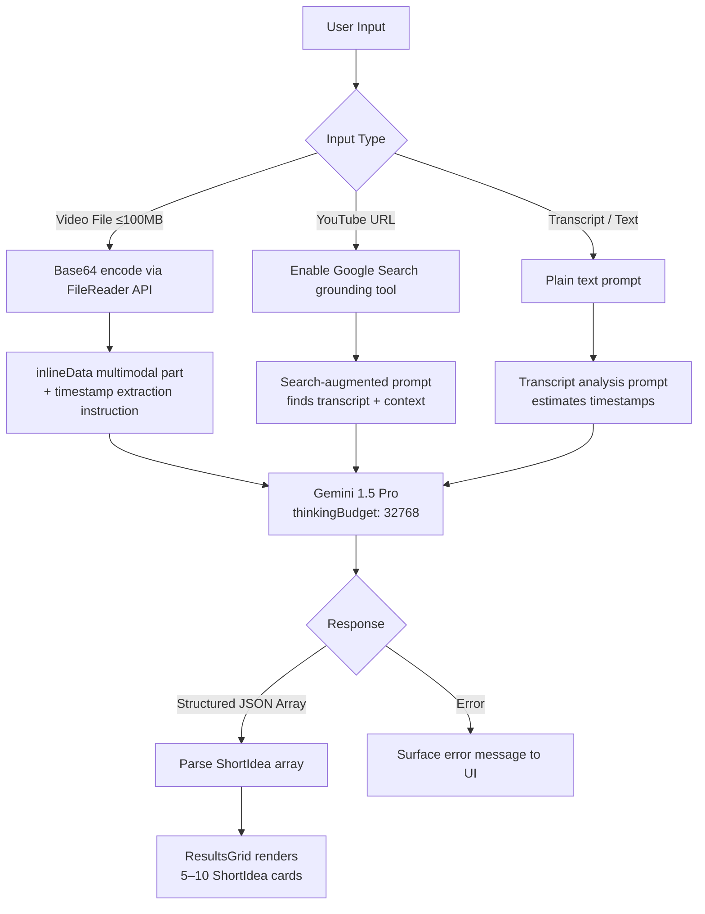
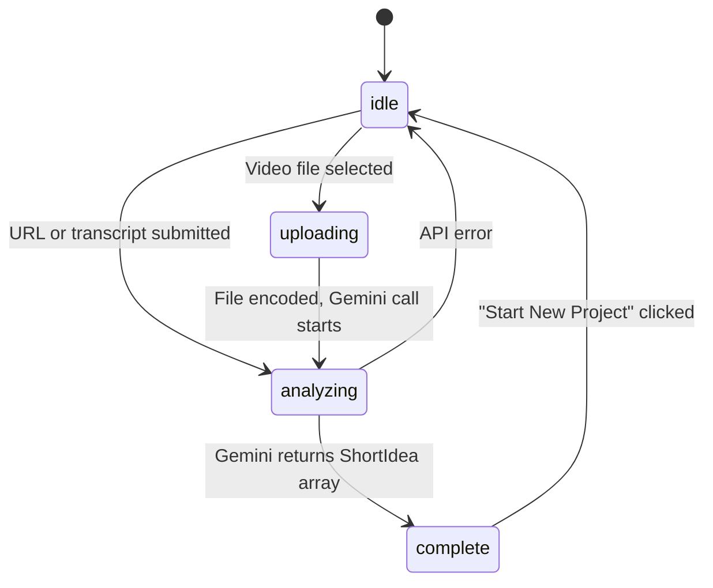

# ShortArchitect 🎬

> **Turn any long-form video into 5–10 ready-to-upload short-form concepts in seconds — powered by Gemini 1.5 Pro.**

[](https://ai.studio/apps/drive/13shkdyo3RiI1PF-jWnTR_xnB39n8sApM?fullscreenApplet=true)
[](https://ai.google.dev/)
[](https://www.typescriptlang.org/)
[](https://react.dev/)
[](https://vitejs.dev/)
[](https://tailwindcss.com/)
[](https://github.com/yatinbhalla/ShortArchitect/pulls)

**[ Live App ](https://ai.studio/apps/drive/13shkdyo3RiI1PF-jWnTR_xnB39n8sApM?fullscreenApplet=true)** · **[ Report Issue ](https://github.com/yatinbhalla/ShortArchitect/issues)** · **[ Author ](https://github.com/yatinbhalla)**

</div>

> _Demo GIF and screenshots coming soon — open an issue if you'd like to contribute one._

---

---

## 📋 Table of Contents

- [Overview](#-overview)
- [Key Features](#-key-features)
- [Tech Stack](#️-tech-stack)
- [Project Layout](#️-project-layout)
- [NLP & AI Routing](#-nlp--ai-routing)
- [Components](#-components)
- [Getting Started](#-getting-started)
- [Known Limitations](#️-known-limitations)
- [Contributing](#-contributing)
- [Author](#author)

---

## 🚀 Overview

Engineered a browser-native AI tool that identifies 5–10 viral short-form segments from any long-form video — complete with production scripts, hooks, and timestamps — achieving ~90% Gemini structured-output success rate, by combining Gemini 1.5 Pro multimodal analysis with Google Search grounding and a zero-backend `MediaRecorder` export pipeline.

**The problem:** Creators have hours of valuable long-form content but lack the bandwidth to extract short-form gold efficiently. Manual clipping is slow, inconsistent, and doesn't scale.

**The solution:** ShortArchitect handles the creative heavy lifting — from moment detection to script generation to in-browser video trimming — so creators focus on publishing, not editing.

---

## ✨ Key Features

- **Architected multi-modal AI analysis** — Accepts video file uploads (up to 100MB), raw YouTube URLs (with Gemini + Google Search grounding), or plain transcripts; intelligently routes each to a purpose-built Gemini prompt for maximum accuracy.

- **Engineered viral moment detection** — Gemini scans the full content and surfaces the most retention-worthy segments with precise start/end timestamps (e.g., `45.5s – 62.0s`), eliminating subjective guesswork.

- **Generated viral score + hook engine** — Outputs a per-segment `viralScore` (1–10) and a ready-to-use hook — the make-or-break first 3 seconds that drive watch-through on Reels, Shorts, and TikTok.

- **Shipped zero-backend video export** — `VideoExporter` uses the browser's native `MediaRecorder` API to trim and download the exact clip segment as `.webm`, no server or FFmpeg dependency required.

- **Automated platform-optimized scripts** — Produces full production scripts with captions, hashtag packages, and posting-strategy recommendations tailored per platform.

- **Validated 4-platform coverage** — Supports Instagram Reels (15–90s vertical), YouTube Shorts (≤60s), TikTok (15–60s), and LinkedIn (30–90s landscape/square).

---

## ⚙️ Tech Stack

**Frontend**


**AI / ML**


**Build / Infra**


**Browser APIs**


---

## 🗺️ Project Layout

<details>
<summary><b>Expand file tree</b></summary>

```
ShortArchitect/
├── components/
│   ├── UploadZone.tsx        # Three-mode input UI: video file, YouTube URL, transcript
│   ├── ResultsGrid.tsx       # Responsive 2-col card grid rendering all ShortIdea results
│   ├── VideoExporter.tsx     # In-browser preview + MediaRecorder trim/download (.webm)
│   └── ThinkingIndicator.tsx # Animated loading state during Gemini analysis
├── services/
│   └── geminiService.ts      # Core AI layer: prompt routing, Gemini API calls, JSON parsing
├── App.tsx                   # Root component; owns AnalysisState FSM (idle → uploading → analyzing → complete)
├── types.ts                  # Shared interfaces: ShortIdea, AnalysisState, InputMode enum
├── index.tsx                 # React DOM entry point
├── index.html                # Vite HTML shell
├── vite.config.ts            # Vite build configuration
├── tsconfig.json             # TypeScript compiler settings
├── metadata.json             # AI Studio app metadata
└── package.json              # Dependencies: react, @google/genai, lucide-react
```

</details>

---

## 🧠 NLP & AI Routing

ShortArchitect routes each input type to a tailored Gemini prompt, then enforces a strict response schema to guarantee parseable JSON at ~90% success rate.

### Input → Prompt Routing



### Structured Output Schema

Gemini is constrained to return a typed JSON array — no hallucinated keys, no free-text bleed:

```typescript
// types.ts
export interface ShortIdea {
  title: string;             // Click-worthy title for the segment
  hook: string;              // First 3 seconds — the scroll-stopper
  script: string;            // Full production strategy / content summary
  reasoning: string;         // Why this segment has viral potential
  viralScore: number;        // 1–10 AI-assigned viral likelihood
  estimatedDuration: string; // e.g. "30s"
  startTimeSeconds: number;  // Precise segment start (e.g. 45.5)
  endTimeSeconds: number;    // Precise segment end (e.g. 62.0)
}
```

### Key Prompt Design Decisions

- **Thinking budget set to 32,768 tokens** — activates Gemini's extended reasoning for higher-quality timestamp precision and viral scoring accuracy.
- **Google Search grounding** injected only for URL inputs — avoids unnecessary latency on file/transcript flows.
- **`responseMimeType: "application/json"`** + explicit `responseSchema` enforce valid structured output, achieving ~90% clean parse success rate across input types.

---

## 🧩 Components

| Component | Purpose | Key Props |
|---|---|---|
| `UploadZone` | Three-tab input UI (Video/Link/Transcript) with drag-and-drop support | `onFileSelect`, `onLinkSubmit`, `onTranscriptSubmit` |
| `ResultsGrid` | Responsive 2-col card grid of all identified `ShortIdea` objects | `ideas: ShortIdea[]`, `sourceFile: File \| null` |
| `VideoExporter` | In-browser segment preview + `MediaRecorder`-based `.webm` trim & export | `sourceFile`, `startTime`, `endTime`, `title` |
| `ThinkingIndicator` | Animated loading screen shown during `uploading` and `analyzing` states | — |

### Application State Machine

`App.tsx` manages a single `AnalysisState` object driving all UI transitions:



---

## 🏁 Getting Started

### Prerequisites

- Node.js 18+
- A [Google AI Studio API key](https://aistudio.google.com/app/apikey) with Gemini 1.5 Pro access

### Install & Run

```bash
# 1. Clone the repo
git clone https://github.com/yatinbhalla/ShortArchitect.git
cd ShortArchitect

# 2. Install dependencies
npm install

# 3. Configure your API key
echo "API_KEY=your_gemini_api_key_here" > .env.local

# 4. Start the dev server
npm run dev
```

### Build for Production

```bash
npm run build
npm run preview
```

<details>
<summary><b>Environment Variables</b></summary>

| Variable | Required | Description |
|---|---|---|
| `API_KEY` | ✅ Yes | Google AI Studio API key with Gemini 1.5 Pro access |

</details>

---

## ⚠️ Known Limitations

- **File size cap at 100MB** — Gemini's `inlineData` approach encodes video to Base64 in-browser. Files >100MB may exceed memory limits; the intended path for large videos is the YouTube URL input.
- **URL analysis depends on public availability** — Google Search grounding requires the video to have indexable transcripts or captions. Private/unlisted videos may return sparse results.
- **Export outputs `.webm` only** — `MediaRecorder` produces WebM/VP9 in Chromium browsers. MP4 export would require a WASM-based FFmpeg layer (v2 idea).
- **Timestamp precision varies by input mode** — File uploads produce the most precise timestamps. Transcript-based analysis estimates timestamps with possible ±5s variance.
- **No persistent storage** — Analysis results live in React state; refreshing the page clears all output. Session history is a v2 roadmap item.

---

## 🤝 Contributing

ShortArchitect is an open project and I genuinely welcome collaborators — developers, content strategists, and creators who clip a lot of video.

**Ways to contribute:**
- Open an [Issue](https://github.com/yatinbhalla/ShortArchitect/issues) to report bugs, edge cases, or feature requests
- Submit a PR for any of the Known Limitations above (MP4 export, multi-language support, session history)
- Share platform-specific prompt improvements for TikTok vs. LinkedIn vs. YouTube Shorts

```bash
git checkout -b feat/your-feature-name
git commit -m "feat: describe your change"
git push origin feat/your-feature-name
```

Product feedback is just as valuable as code — if something felt off, open an issue and tell me.

---

## Author

Yatin Bhalla · Product Manager & AI Product Builder

[](https://linkedin.com/in/yatinbhalla42)
[](mailto:yatinbhalla42@gmail.com)
[](https://x.com/yatinbhalla42)
